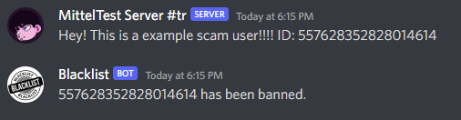

# Blacklist Discord bot

## <b>What is it?</b>
The Bot bans every ID from a webhook message automatically.

## <b>Example</b>


<br>

## <b>How to use it?</b>

### <b>Use this link if you don't want to self-host the bot.</b>

https://discord.com/api/oauth2/authorize?client_id=973683659666235482&permissions=2052&scope=bot%20applications.commands

<br>

### ➡️ <b>1.</b> Clone the repository

```txt
git clone https://github.com/Mittelbots/blacklist-bot.git
```

### ➡️ <b>2.</b> Install the dependencies

```txt
npm install
```

### ➡️ <b>3.</b> Change `assets/config/config.example.json` to `config.json` and fill out the fields

```json
{
    "DISCORD_APPLICATION_ID": "//YOUR APPLICATION ID//",
}
```

### ➡️ <b>4.</b> Change `assets/token/token.example.json` to `token.json` and fill out the fields

```json
{
    "token": "//YOUR BOT TOKEN//",
}
```

### ➡️ <b>5.</b> Change `assets/settings/b_channels.example.json` to `b_channels.json`. But dont write anything in it.

```json
{}
```

### ➡️ <b>5.</b> Run the bot


```txt
npm start

// If you use pm2
start: 
npm run pm2_start

restart:
npm run pm2_restart

stop:
npm run pm2_stop
```

### ➡️ <b>6.</b> Type /settings setchannel [Your Channel]
